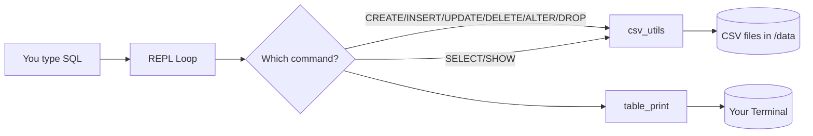
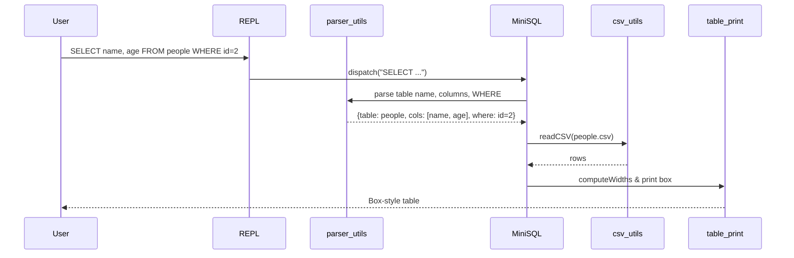

# MiniSQL-CPP (Portable Toy Database)

**MiniSQL-CPP** is a beginner-friendly, single-binary project that acts like a tiny SQL engine over **CSV files**. You can create tables, insert/update/delete rows, alter columns, select data, and pretty‑print results — all from a simple REPL.

## Why this project?
- **Teaches fundamentals**: parsing, file I/O, formatting, basic SQL-like grammar.
- **No DB server**: just CSV files. Easy to run anywhere.
- **Safe default storage**: data folder that works on any machine.

---

## Build & Run

### Prerequisites
- A C++17 compiler (GCC, Clang, or MSVC)
- CMake 3.14+

### Build (CMake)
```bash
mkdir build && cd build
cmake ..
cmake --build .
./minisql   # macOS/Linux
minisql.exe # Windows
```

### Storage Location
- By default: `./data` **next to the executable**.
- Override with environment variable: `MINISQL_DATA=/absolute/or/relative/path`.

Check paths anytime:
```sql
SHOW PATH;
```

---

## REPL Commands

- `CREATE TABLE <name> (col1, col2, ...);`
- `INSERT INTO <name> VALUES (v1, v2, ...);`
- `UPDATE <name> SET col=val, col2="val2" WHERE key="abc";`
- `DELETE FROM <name> WHERE col = value;`
- `ALTER TABLE <name> ADD <column>;`
- `ALTER TABLE <name> DROP <column>;`
- `DROP TABLE <name>;`
- `SELECT * FROM <name>;` or `SELECT col1, col2 FROM <name> WHERE ...;`
- `SHOW TABLE <name>;` (pretty-prints the whole table)
- `SHOW PATH;`
- `EXIT;`

> Notes
> - Values can be `'single'` or `"double"` quoted. Commas inside quotes are supported.
> - No types/schemas beyond column count. All values are strings.

---

## Quick Start (Hands-on)
```sql
CREATE TABLE people (id, name, age);
INSERT INTO people VALUES (1, "Bob", 30);
INSERT INTO people VALUES (2, "Ana", 25);
SELECT * FROM people;
```
Output:
```
+----+------+-----+
| id | name | age |
+----+------+-----+
| 1  | Bob  | 30  |
| 2  | Ana  | 25  |
+----+------+-----+
```

Filter and project:
```sql
SELECT name, age FROM people WHERE id=2;
```
```
+------+-----+
| name | age |
+------+-----+
| Ana  | 25  |
+------+-----+
```

---

## How it works (Simple Terms)

### Big Picture
```
You type commands  →  Mini parser decides which command it is  →  Command handler
                                             ↓
                               Reads/Writes CSV files in /data
                                             ↓
                              Prints pretty tables in your terminal
```

### Main Parts (Files)
- **`src/MiniSQL.cpp, .hpp`** — The boss. Runs the REPL and routes commands.
- **`src/utils/parser_utils.*`** — Finds table names, splits `SET a=1, b=2`, parses `WHERE col=val`, etc.
- **`src/utils/string_utils.*`** — Trimming, case-insensitive search, quote cleanup.
- **`src/utils/csv_utils.*`** — Reads and writes CSV files safely (handles `""` escaping).
- **`src/utils/table_print.*`** — Calculates column widths and prints the box table.
- **`src/main.cpp`** — Starts the app.

### Data Flow (Mermaid)


### Command Handling (Mermaid Sequence)


---

## Common Pitfalls (and friendly fixes)

- **“Unknown command.”** → Check spelling and the semicolon `;` at the end.
- **“Column count mismatch.”** → Your `INSERT` values must match the number of columns.
- **“Unknown column”** → Column name must exist exactly as in your `CREATE TABLE` header.
- **Nothing prints in `SELECT`** → Maybe your `WHERE` didn’t match any rows.
- **Deleting everything by accident** → `DELETE FROM table;` asks for confirmation unless `WHERE` is present.

---

## Extend It (Mini Roadmap)
- Add comparison operators (`<`, `>`, `!=`) in `WHERE`.
- Add `ORDER BY` and `LIMIT`.
- Add a tiny index file for fast lookups on a chosen column.
- Support `IMPORT/EXPORT` CSV commands.

---
